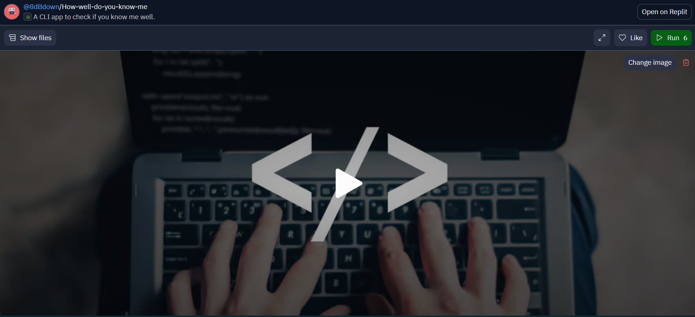
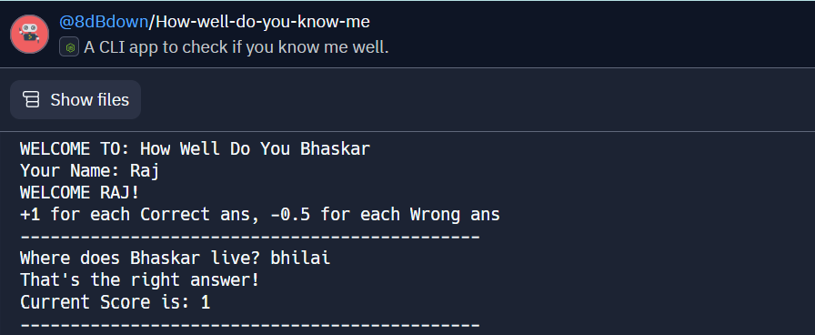
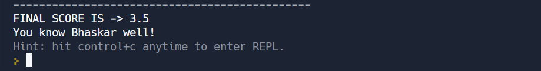
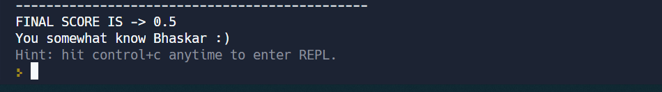
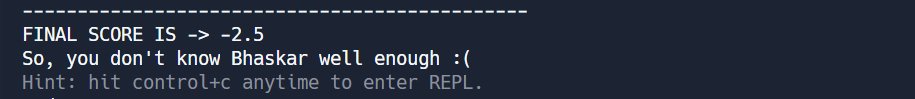

# How well do you know Me !
A Fun CLI app to test if you know me well.

Here are a few project-related insight pictures:

1. Landing Page 

2. Initial Greetings and Quiz rules

3. Case1: You know me well, answered almost all questions correctly

4. Case2: If you answered some questions incorrectly, following is the result you get

5. Case3: If you answered almost all incorrectly, you get a negative score !

> Technologies/Libraries used :-
* NodeJs
* Chalk (for CSS)
* readline-sync

> Platform used to develop project :-
* [Replit](https://replit.com/)

